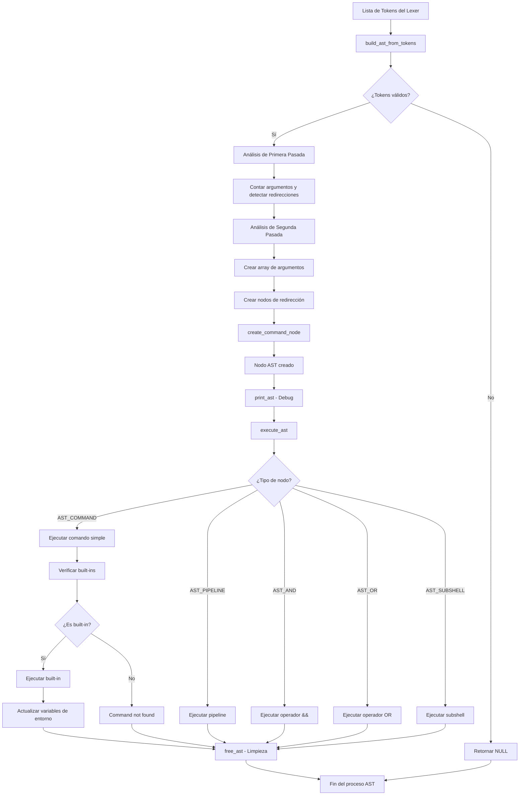

# Diagrama y descripción de Flujo del AST

Este documento describe el flujo específico del AST en el Minishell, desde la conversión de tokens hasta la ejecución de comandos mediante el árbol sintáctico abstracto.

---

## 🌳 Diagrama de Flujo del AST



---

## 🧠 Descripción Detallada del Flujo

### 1. **Construcción del AST (`build_ast_from_tokens`)**

El parser del AST recibe la lista de tokens del lexer y realiza dos pasadas:

**Primera Pasada - Análisis:**

- Cuenta argumentos de tipo `TOKEN_WORD`
- Detecta redirecciones (`TOKEN_REDIR_IN`, `TOKEN_REDIR_OUT`, `TOKEN_APPEND`, `TOKEN_HEREDOC`)
- Crea lista enlazada de redirecciones

**Segunda Pasada - Construcción:**

- Crea array de argumentos con `strdup()`
- Asigna NULL al final del array
- Crea el nodo comando con argumentos y redirecciones

### 2. **Tipos de Nodos AST**

```c
typedef enum e_ast_node_type
{
    AST_COMMAND,     // Comando simple: ls -la
    AST_PIPELINE,    // Pipeline: cmd1 | cmd2  
    AST_AND,         // Operador &&
    AST_OR,          // Operador ||
    AST_SUBSHELL     // Subshell o agrupación ()
}   t_ast_node_type;
```

### 3. **Ejecución del AST (`execute_ast`)**

El ejecutor analiza el tipo de nodo y:

- **AST_COMMAND**: Verifica built-ins (`env`, `pwd`, `cd`) y los ejecuta
- **AST_PIPELINE**: (Pendiente) Manejará pipes entre comandos
- **AST_AND/OR**: (Pendiente) Manejará operadores lógicos
- **AST_SUBSHELL**: (Pendiente) Manejará subshells

### 4. **Gestión de Memoria**

- `free_ast()` libera recursivamente toda la estructura
- Libera argumentos, redirecciones, y nodos hijos
- Se ejecuta al final del proceso para evitar memory leaks

---

## 📝 Ejemplos Prácticos

### Ejemplo 1: Comando Simple

**Input:** `ls -la`

**Tokens generados:**

```
TOKEN_WORD: "ls"
TOKEN_WORD: "-la"
TOKEN_EOF
```

**AST resultante:**

```
COMMAND: ls -la
```

**Estructura interna:**

```c
t_ast_node {
    type = AST_COMMAND,
    args = ["ls", "-la", NULL],
    redirects = NULL,
    left = NULL, right = NULL, child = NULL
}
```

### Ejemplo 2: Built-in con Argumento

**Input:** `cd /home/user`

**Tokens generados:**

```
TOKEN_WORD: "cd"
TOKEN_WORD: "/home/user"
TOKEN_EOF
```

**AST resultante:**

```
COMMAND: cd /home/user
```

**Ejecución:**

1. `execute_ast()` detecta `AST_COMMAND`
2. Compara `args[0]` con "cd"
3. Llama `builtin_cd(data, "/home/user")`
4. Actualiza variable `_=` con "cd"

### Ejemplo 3: Comando con Redirección

**Input:** `echo "hello" > output.txt`

**Tokens generados:**

```
TOKEN_WORD: "echo"
TOKEN_WORD: "hello"
TOKEN_REDIR_OUT: ">"
TOKEN_WORD: "output.txt"
TOKEN_EOF
```

**AST resultante:**

```
COMMAND: echo hello
  REDIRECT: type=TOKEN_REDIR_OUT, file=output.txt
```

**Estructura interna:**

```c
t_ast_node {
    type = AST_COMMAND,
    args = ["echo", "hello", NULL],
    redirects = {
        type = TOKEN_REDIR_OUT,
        file = "output.txt",
        fd = -1,
        next = NULL
    }
}
```

### Ejemplo 4: Pipeline (Pendiente)

**Input:** `ls -la | grep txt`

**AST esperado:**

```
PIPELINE:
  COMMAND: ls -la
  COMMAND: grep txt
```

**Estructura interna esperada:**

```c
t_ast_node {
    type = AST_PIPELINE,
    left = node_ls,    // COMMAND: ls -la
    right = node_grep, // COMMAND: grep txt
    args = NULL, redirects = NULL, child = NULL
}
```

### Ejemplo 5: Operadores Lógicos (No obligatorio?)

**Input:** `cd /tmp && ls -la`

**AST esperado:**

```
AND:
  COMMAND: cd /tmp
  COMMAND: ls -la
```

---

## 🔧 Funciones Clave del AST

### Creación de Nodos

```c
t_ast_node *create_command_node(char **args, t_ast_redirect *redirects);
t_ast_node *create_pipeline_node(t_ast_node *left, t_ast_node *right);
t_ast_redirect *create_redirect_node(t_token_type type, char *file);
```

### Parser Principal

```c
t_ast_node *build_ast_from_tokens(t_token *token_list);
```

### Ejecutor

```c
int execute_ast(t_data *data, t_ast_node *ast);
```

### Utilidades

```c
void print_ast(t_ast_node *node, int depth);  // Debug
void free_ast(t_ast_node *node);              // Limpieza
```

---

## 🚀 Ventajas del AST

1. **Estructura Clara**: Representa la sintaxis de forma jerárquica
2. **Extensibilidad**: Fácil añadir nuevos tipos de nodos
3. **Separación de Responsabilidades**: Parser vs Ejecutor
4. **Debug Mejorado**: Visualización clara con `print_ast()`
5. **Gestión de Memoria**: Liberación recursiva y controlada

---

## 🔄 Integración con el Flujo General

El AST se integra en el flujo general del Minishell de la siguiente manera:

```
Lexer → Tokens → AST Parser → AST → AST Executor → Built-ins/Comandos
```

Se reemplaza la función `detective_conan()` original, proporcionando una arquitectura más robusta y escalable para el análisis y ejecución de comandos.

---

## 📋 Estado Actual vs Futuro

**✅ Implementado:**

- Comandos simples (`AST_COMMAND`)
- Built-ins básicos (`env`, `pwd`, `cd`)
- Detección de redirecciones
- Debug y limpieza de memoria

**🔄 Pendiente:**

- Ejecución de pipelines (`AST_PIPELINE`)
- Operadores lógicos (`AST_AND`, `AST_OR`)
- Subshells (`AST_SUBSHELL`)
- Manejo completo de redirecciones
- Comandos externos (execve)