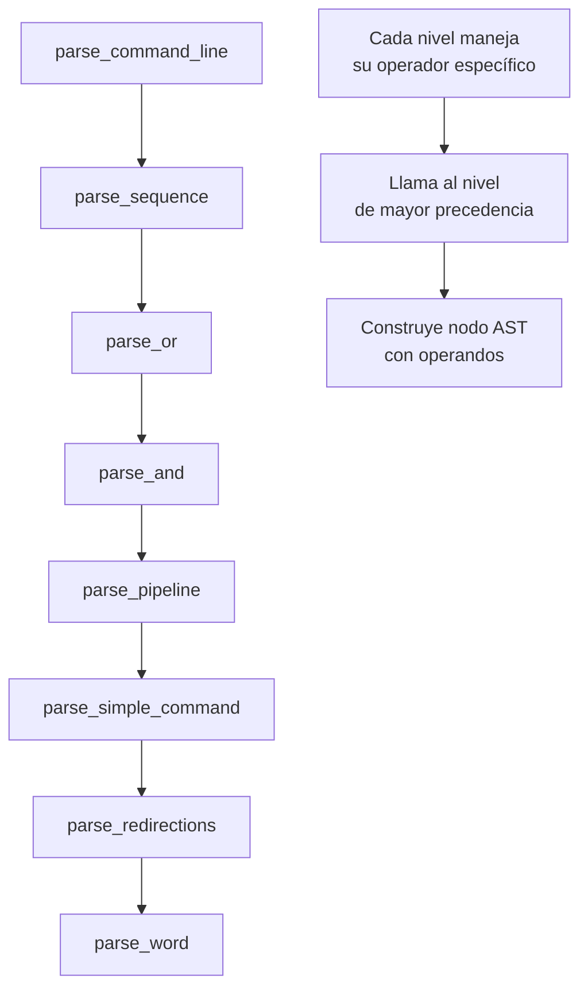
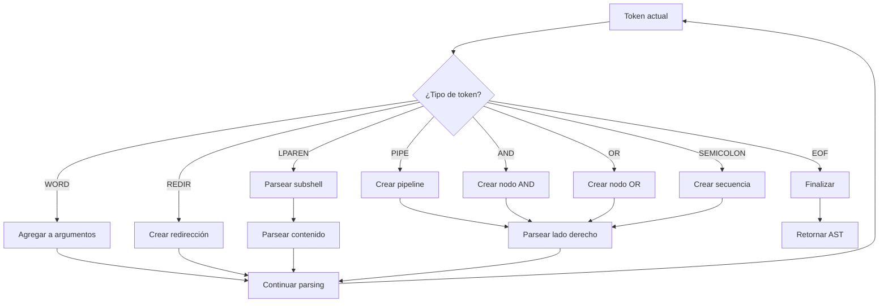

# Precedencia y Orden de Parsing en AST

Este documento explica cómo determinar el orden y las prioridades al construir el AST, basado en la gramática de shells y la precedencia de operadores.

---

## 🏆 Tabla de Precedencia (de mayor a menor)

| Prioridad | Operador             | Descripción          | Asociatividad       | Ejemplo             |
| --------- | -------------------- | -------------------- | ------------------- | ------------------- |
| **1**     | `()`                 | Agrupación/Subshells | N/A                 | `(cmd1; cmd2)`      |
| **2**     | `<`, `>`, `>>`, `<<` | Redirecciones        | Izquierda a derecha | `cmd < file > out`  |
| **3**     | \|                   | Pipe                 | Pipes               | Izquierda a derecha |
| **4**     | `&&`                 | AND lógico           | Izquierda a derecha | `cmd1 && cmd2`      |
| **5**     | \|\|                 | OR lógico            |                     | OR lógico           |
| **6**     | `;`                  | Secuencia            | Izquierda a derecha | `cmd1; cmd2`        |

---

## 🧠 Algoritmo de Parsing (Recursive Descent)



---

## 📋 Implementación Paso a Paso

### 1. **Parser Principal - Maneja `;` (menor precedencia)** `*no obligatorio*`

```c
t_ast_node *parse_command_line(t_token **tokens)
{
    t_ast_node *left = parse_or(tokens);
    
    while (*tokens && (*tokens)->type == TOKEN_SEMICOLON)
    {
        advance_token(tokens); // Consumir ';'
        t_ast_node *right = parse_or(tokens);
        left = create_sequence_node(left, right);
    }
    
    return left;
}
```

### 2. **Parse OR - Maneja `||`** `*bonus*`

```c
t_ast_node *parse_or(t_token **tokens)
{
    t_ast_node *left = parse_and(tokens);
    
    while (*tokens && (*tokens)->type == TOKEN_OR)
    {
        advance_token(tokens); // Consumir '||'
        t_ast_node *right = parse_and(tokens);
        left = create_or_node(left, right);
    }
    
    return left;
}
```

### 3. **Parse AND - Maneja `&&`** `*bonus*`

```c
t_ast_node *parse_and(t_token **tokens)
{
    t_ast_node *left = parse_pipeline(tokens);
    
    while (*tokens && (*tokens)->type == TOKEN_AND)
    {
        advance_token(tokens); // Consumir '&&'
        t_ast_node *right = parse_pipeline(tokens);
        left = create_and_node(left, right);
    }
    
    return left;
}
```

### 4. **Parse Pipeline - Maneja `|`**

```c
t_ast_node *parse_pipeline(t_token **tokens)
{
    t_ast_node *left = parse_simple_command(tokens);
    
    while (*tokens && (*tokens)->type == TOKEN_PIPE)
    {
        advance_token(tokens); // Consumir '|'
        t_ast_node *right = parse_simple_command(tokens);
        left = create_pipeline_node(left, right);
    }
    
    return left;
}
```

### 5. **Parse Simple Command - Maneja palabras y redirecciones**

```c
t_ast_node *parse_simple_command(t_token **tokens)
{
    char **args = NULL;
    t_ast_redirect *redirects = NULL;
    int arg_count = 0;
    
    // Procesar palabras y redirecciones en cualquier orden
    while (*tokens && is_command_token((*tokens)->type))
    {
        if ((*tokens)->type == TOKEN_WORD)
        {
            // Añadir argumento
            args = realloc_args(args, ++arg_count);
            args[arg_count - 1] = strdup((*tokens)->value);
            advance_token(tokens);
        }
        else if (is_redirect_token((*tokens)->type))
        {
            // Añadir redirección
            t_token_type redir_type = (*tokens)->type;
            advance_token(tokens);
            
            if (!*tokens || (*tokens)->type != TOKEN_WORD)
                return NULL; // Error: falta archivo
                
            t_ast_redirect *new_redir = create_redirect_node(redir_type, (*tokens)->value);
            add_redirect(&redirects, new_redir);
            advance_token(tokens);
        }
    }
    
    if (arg_count == 0)
        return NULL; // No hay comando
        
    args[arg_count] = NULL; // Terminar array
    return create_command_node(args, redirects);
}
```

---

## 🎯 Ejemplos de Precedencia

### Ejemplo 1: `cmd1 && cmd2 || cmd3`

**Parsing:**

1. `parse_or()` encuentra el `||` (menor precedencia en este nivel)
2. Divide en: `(cmd1 && cmd2)` y `cmd3`
3. `parse_and()` procesa el `&&` en el lado izquierdo

**AST resultante:**

```
OR:
├── AND:
│   ├── COMMAND: cmd1
│   └── COMMAND: cmd2
└── COMMAND: cmd3
```

### Ejemplo 2: `cmd1 | cmd2 && cmd3`

**Parsing:**

1. `parse_and()` encuentra el `&&` primero
2. Divide en: `(cmd1 | cmd2)` y `cmd3`
3. `parse_pipeline()` procesa el `|` en el lado izquierdo

**AST resultante:**

```
AND:
├── PIPELINE:
│   ├── COMMAND: cmd1
│   └── COMMAND: cmd2
└── COMMAND: cmd3
```

### Ejemplo 3: `echo hello > file | cat`

**Parsing:**

1. `parse_pipeline()` encuentra el `|`
2. Divide en: `(echo hello > file)` y `cat`
3. `parse_simple_command()` maneja la redirección en el comando izquierdo

**AST resultante:**

```
PIPELINE:
├── COMMAND: echo hello
│   └── REDIRECT: type=TOKEN_REDIR_OUT, file=file
└── COMMAND: cat
```

---

## 🔧 Funciones Auxiliares Necesarias

```c
// Avanzar al siguiente token
void advance_token(t_token **tokens)
{
    if (*tokens && (*tokens)->next)
        *tokens = (*tokens)->next;
}

// Verificar si es token de comando
int is_command_token(t_token_type type)
{
    return (type == TOKEN_WORD || 
            type == TOKEN_REDIR_IN || 
            type == TOKEN_REDIR_OUT ||
            type == TOKEN_APPEND || 
            type == TOKEN_HEREDOC);
}

// Verificar si es token de redirección
int is_redirect_token(t_token_type type)
{
    return (type == TOKEN_REDIR_IN || 
            type == TOKEN_REDIR_OUT ||
            type == TOKEN_APPEND || 
            type == TOKEN_HEREDOC);
}

// Redimensionar array de argumentos
char **realloc_args(char **args, int new_size)
{
    return realloc(args, sizeof(char*) * (new_size + 1));
}

// Añadir redirección a la lista
void add_redirect(t_ast_redirect **head, t_ast_redirect *new_redir)
{
    if (!*head)
        *head = new_redir;
    else
    {
        t_ast_redirect *current = *head;
        while (current->next)
            current = current->next;
        current->next = new_redir;
    }
}
```

---

## 🚀 Parser Completo Mejorado

```c
// Reemplazar tu build_ast_from_tokens con esto:
t_ast_node *build_ast_from_tokens(t_token *token_list)
{
    if (!token_list)
        return NULL;
        
    t_token *current = token_list;
    return parse_command_line(&current);
}
```

---

## 📊 Flujo de Decisión del Parser



---

## 🎖️ Reglas Clave de Precedencia

1. **Mayor precedencia = se evalúa primero = más profundo en el AST**
2. **Los paréntesis `()` siempre tienen máxima precedencia**
3. **Las redirecciones se asocian al comando más cercano**
4. **Los operadores de misma precedencia se asocian de izquierda a derecha**
5. **El parser trabaja de menor a mayor precedencia (top-down)**

---

## 🏃‍♂️ Implementación Paso a Paso

1. **Implementar funciones auxiliares** (`advance_token`, `is_command_token`, etc.)
2. **Empezar con `parse_simple_command`** (casos más simples)
3. **Añadir `parse_pipeline`** (manejar pipes)
4. **Añadir `parse_and` y `parse_or`** (operadores lógicos)
5. **Integrar todo en `parse_command_line`**
6. **Probar con casos simples antes de casos complejos**

Este enfoque garantiza que el AST respete la precedencia correcta de los operadores de shell.