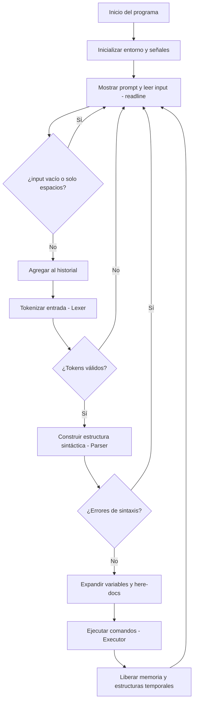

# Diagrama de Flujo General

Este documento describe el flujo general de ejecución del Minishell, desde que se muestra el prompt hasta que se ejecuta un comando o se detecta un error. También puede usarse como referencia para entender la relación entre módulos.

---

## 🔄 Diagrama de Flujo General

---

## 🧠 Descripción del Flujo

1. **Inicio e inicialización**
    
    - Se cargan las variables de entorno.
        
    - Se configuran las señales (SIGINT, SIGQUIT, etc.).
        
2. **Lectura del input**
    
    - Se muestra el prompt (`minishell$` ).
        
    - Se lee la línea con `readline()`.
        
    - Si la entrada está vacía o solo contiene espacios, se ignora.
        
3. **Historial**
    
    - Las líneas válidas se añaden al historial de comandos (`add_history`).
        
4. **Lexer**
    
    - Divide el input en tokens: comandos, argumentos, operadores (`|`, `>`, `<`, etc.).
        
    - Maneja comillas, escape y delimitadores.
        
5. **Parser**
    
    - Convierte los tokens en estructuras sintácticas (ej: árboles, listas).
        
    - Detecta errores como pipes al inicio o fin, comillas no cerradas, etc.
        
6. **Expansión y Preprocesamiento**
    
    - Expande variables de entorno (`$VAR`).
        
    - Maneja here-docs (`<<`) antes de ejecutar.
        
7. **Ejecución**
    
    - Ejecuta built-ins o comandos externos.
        
    - Maneja redirecciones, pipes, sub-shells.
        
8. **Limpieza**
    
    - Libera estructuras de lexer, parser, heredocs, etc.
        
    - Vuelve al prompt para un nuevo comando.
        

---

Este flujo debe asegurar que el shell funcione correctamente en todas las fases: desde el análisis léxico hasta la ejecución y respuesta del sistema.